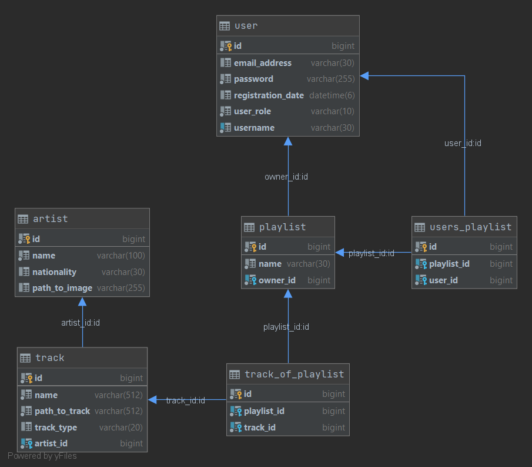

# NNPIA Semestrální práce

##Popis aplikace

Aplikace umožnňuje uživatelům vytvářet hudební playlisty a sdílet je mezi sebou.

##Poznámky k funkčnosti aplikace

Každý playlist má právě jednoho vlatníka, který může jeho playlist modifikovat (přidávat a odebárat skladby).
Uživatelé, kteří si tento playlist takzvaně "přidají", pak tento odebírají - nemohou ho však modifikovat.
 
Přidávat umělce a skladby (mp3 soubory) do aplikace může pouze uživatel s oprávněním admin.

##Popis API
* Artists
    * [GET]     /artists
    * [GET]     /artists/{id}
    * [POST]    /artists
    * [DELETE]  /artists/{id}
* Tracks
    * [GET]     /tracks
    * [POST]    /tracks
    * [DELETE]  /tracks/{id}
* Playlists
    * [GET]     /playlists
    * [GET]     /playlists/{id}
    * [POST]    /playlists
    * [DELETE]  /playlists/{id}
    * [POST]    /playlists/tracks
        * přidání skladeb do playlistu
    * [DELETE]  /playlists/tracks
        * odebrání skladby z playlistu
* Users playlists
    * [GET]     /user/playlists
    * [GET]     /user/playlists/{id}
        * vrátí seznam skladeb uživatelova playlistu
    * [POST]    /user/playlists/{id}
        * přidá playlist k uživatelovým (uživatel se stane odběratelem)
    * [DELETE]  /user/playlists/{id}
        * odebere playlist z uživatelových (uživatel přestane být odběratelem)
* User
    * [POST]    /signup
    * [GET]     /user/{username}
        * získání oprávnění uživatele

## Technické požadavky
Při spuštění aplikace je vytvořen výchozí účet s oprávněními administrátora.
(admin/admin). 

Inicializační SQL soubor: [data.sql](src/main/resources/data.sql).

## Potřebné údaje pro spuštění

Před spuštěním aplikace je potřeba spustit databázi a vytvořit v ní databázi pro aplikaci.
Také je potřeba v datbázi nastavit přihlašovací údaje a následně je změni v nastavení aplikace
v [application.properties](src/main/resources/application.properties).

REST API je ve vývojovém režimu dostupné na adrese [http://localhost:8080](http://localhost:8080).

## Databázový model

## Adresy

[Github](https://github.com/michalcernota/music)

[Produkce](https://music-share-nnpia-be.herokuapp.com/)